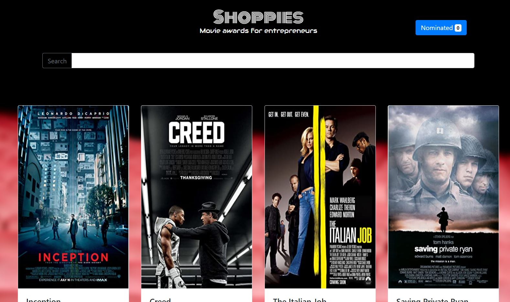
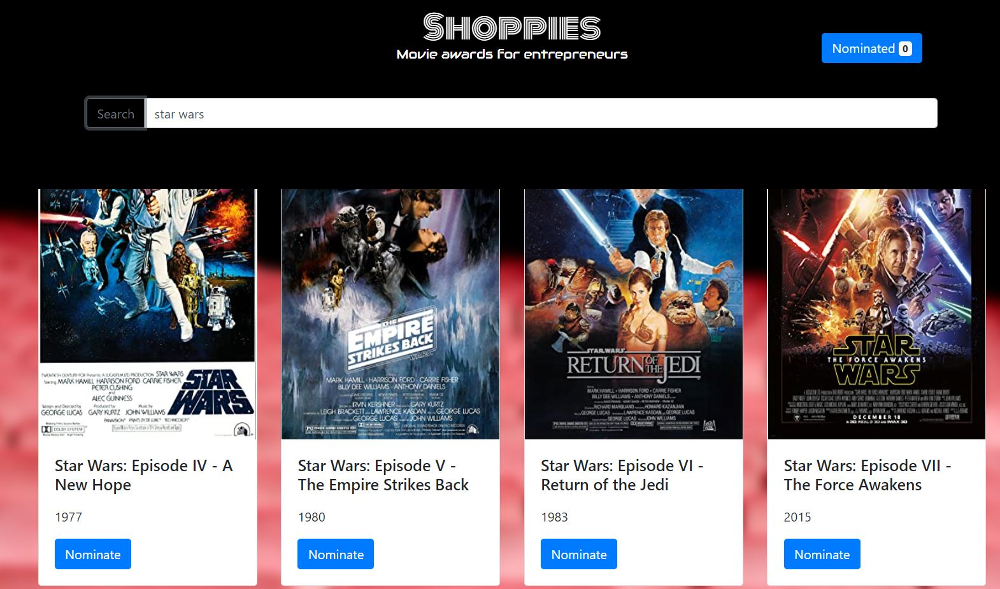
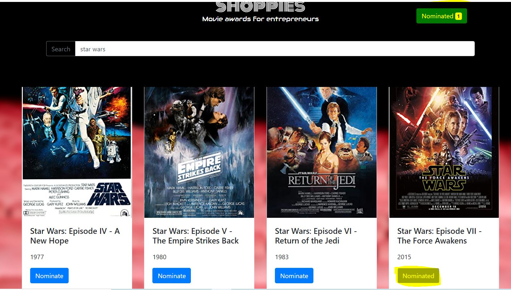
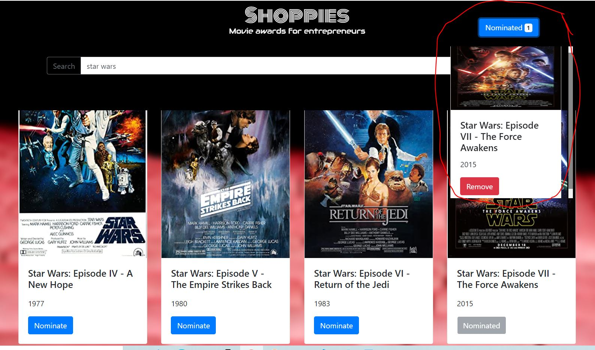
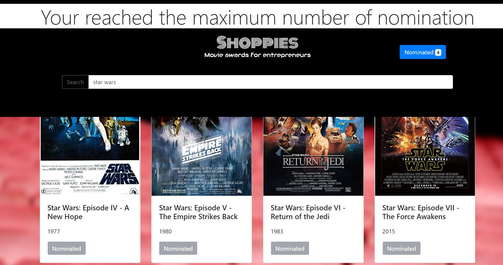
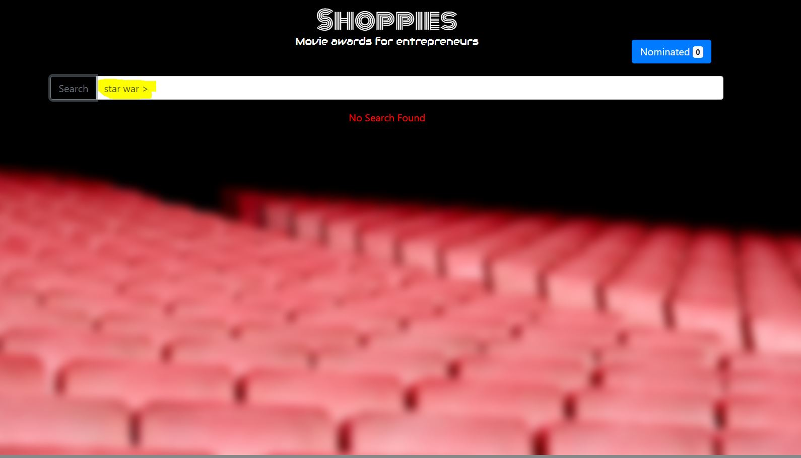

# shoppies

#### Shopies in an App that allows its users to search movies from the OMDB API and nominate up to 4 of them. it is build with React and enhanced with some backend functionalities to store the nomination list in a Mongo DB (Mern Stack)

## Technolgies Used

### front end

#### React   Bootstrap 4

### Back end

#### Node   Express   MongoDB

## Demo

 ### Landing View 

 ### Movie Searching 

 ### Movie Nominating 

 ### Reaching Maximum number of nominations 

 ### Error Handeling 

